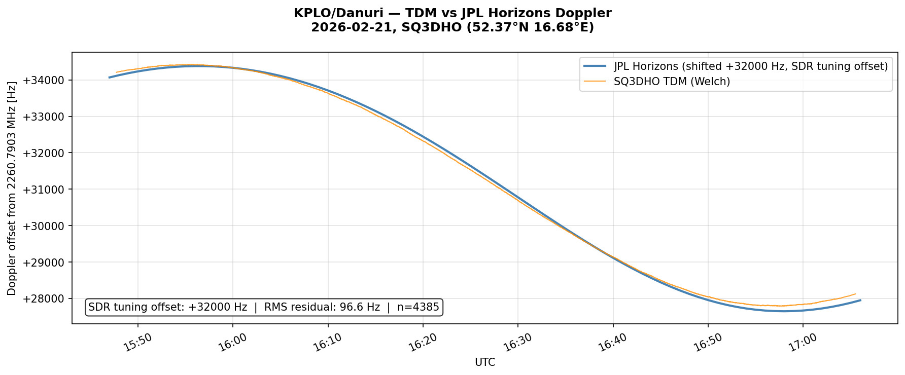
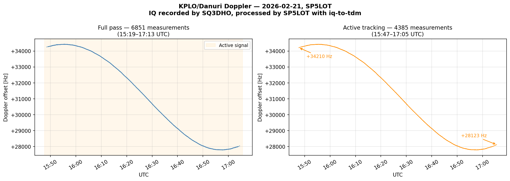
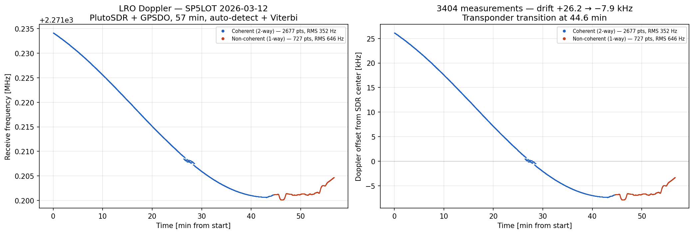

# iq-to-tdm — SDR IQ to NASA CCSDS TDM v2.0 Converter

Converts amateur radio SDR IQ recordings to NASA CCSDS Tracking Data Message (TDM) format
for submission to NASA Artemis II and lunar mission Doppler tracking programs.

**Station:** SP5LOT — Warsaw, Poland
**Missions:** Artemis I/II (Orion), KPLO/Danuri, LRO

---

## In Plain Words

You recorded a spacecraft signal with your SDR. This tool reads the IQ file, finds the
carrier frequency in each second of the recording using signal processing, and writes a
standard NASA file (TDM) with the Doppler shift over time.

**It works automatically** — just point it at your `.sigmf-meta` or `.wav` file:

```bash
python iq_to_tdm.py --input recording.sigmf-meta --station MY_CALLSIGN --spacecraft LRO
python iq_to_tdm.py --input "recording.wav" --station MY_CALLSIGN --spacecraft ORION
```

The converter automatically detects the signal type (strong carrier, weak carrier, suppressed
carrier) and selects the right processing method. No flags needed — it just works.

If you also provide `--location`, the converter queries JPL Horizons after processing
to validate your measurements and classify transponder segments (coherent vs non-coherent):

```bash
python iq_to_tdm.py --input recording.sigmf-meta --station MY_CALLSIGN \
    --spacecraft LRO --location "52.15,21.19,120"
```

---

## Detection Modes

The converter has four detection methods. In most cases you don't need to choose —
auto-detect picks the right one:

| Signal type | Method | When auto-detect uses it | Manual flag |
|---|---|---|---|
| Strong CW carrier (KPLO, LRO, Artemis I) | Welch periodogram | Carrier found in probe (10 blocks) | _(default)_ |
| Weak CW carrier (LRO on small antenna, SOHO) | Viterbi ridge tracker on spectrogram | No carrier in probe, signal found in coarse scan | `--weak` |
| Suppressed carrier (Artemis II OQPSK) | IQ⁴ carrier recovery, per-block | OQPSK detected in probe | `--oqpsk` |
| Suppressed + weak carrier | IQ⁴ + Viterbi ridge tracker | _(manual only)_ | `--oqpsk --weak` |

**Auto-detect pipeline:** The converter probes the first 10 blocks with both CW and OQPSK
methods. If neither finds a signal, it switches to weak mode — runs a coarse Viterbi scan
to find the signal, then tracks it with full resolution. No manual flags needed.

**OQPSK explained:** Artemis II uses OQPSK modulation — the carrier is suppressed by the
data and disappears as a discrete spectral line. Raising the IQ samples to the 4th power
mathematically removes the data modulation (all four phase states 0°/90°/180°/270° become
0° when multiplied by 4), leaving a clean CW tone at 4×Δf. Dividing by 4 gives the true
Doppler offset. This technique was also used by the CAMRAS Dwingeloo team for their
Artemis I OQPSK tracking (`quad` files).

**Viterbi ridge tracker:** For signals too weak for per-block detection (SNR < 3 dB),
the converter builds a spectrogram (all blocks at once) and uses dynamic programming
(Viterbi algorithm) to find the optimal frequency track through the noise. This
accumulates SNR across the entire recording — even signals at 0 dB per block become
detectable when the track spans hundreds of frames.

---

## Features

- Reads **SigMF** (`.sigmf-meta` + `.sigmf-data`), **WAV** (SDR Console, SDR#, HDSDR, SDRuno), and **GQRX** raw recordings
- Supported IQ formats: `cf32_le`, `cf64_le`, `ci16_le`, `ci8`, `cu8` (WAV: `cf32_le`, `ci16_le`, `cu8`)
- **Automatic signal detection** — no manual mode selection needed (CW → OQPSK → Viterbi)
- Carrier detection via **Welch averaged periodogram** with parabolic sub-bin interpolation
  — gain of ~13 dB SNR with default 20 sub-blocks
- **Viterbi ridge tracker** for weak signals below per-block detection threshold
- **`--oqpsk`** mode: IQ⁴ suppressed-carrier recovery for OQPSK/BPSK signals (Artemis II)
- **`--oqpsk --weak`** combined mode: IQ⁴ + Viterbi for suppressed carrier at low SNR
- Outputs **CCSDS TDM v2.0 KVN** (`RECEIVE_FREQ_2`) ready for NASA submission
- **JPL Horizons validation** — when `--spacecraft` and `--location` are provided, compares
  measured Doppler against ephemeris predictions and classifies coherent/non-coherent
  transponder segments. Measured frequencies are never modified — only TDM metadata
  (segment labels, turnaround ratio) is updated
- Memory-mapped I/O for files larger than 2 GB
- Optional carrier hint (`--carrier-hint`, `--hint-bw`) for recordings with nearby interference
- Automatic SNR threshold lowering for weak signals (median probe SNR ≥ 1.5 dB)
- Interactive probe phase with automatic parameter suggestions (disable with `--no-interactive`)
- Optional Welch spectrum plot to PNG (`--plot`)

---

## Quick Start

```bash
python iq_to_tdm.py \
    --input recording.sigmf-meta \
    --station MY_CALLSIGN \
    --spacecraft LRO
```

That's it — the output TDM file is named automatically (`MY_CALLSIGN_LRO_20260306_001410.tdm`).

Add `--location` to enable JPL Horizons validation after processing:

```bash
python iq_to_tdm.py \
    --input recording.sigmf-meta \
    --station MY_CALLSIGN \
    --spacecraft LRO \
    --location "52.15,21.19,120"
```

This queries JPL Horizons for the expected Doppler, reports the RMS residual between
your measurements and the ephemeris, and classifies transponder segments as coherent
(2-way, DSN uplink active) or non-coherent (1-way, free-running oscillator).
**Your measured frequencies are never changed** — only TDM metadata (segment boundaries,
turnaround ratio) is updated based on the classification.

---

## Validation

Three independent validations confirm the converter produces correct Doppler measurements.

### 1 — Artemis I, CAMRAS Nov 30 2022 — IQ + matching reference TDM

**This is the primary validation: the same IQ file processed two ways, results agree to ~3–5 Hz.**

CAMRAS Dwingeloo (25 m dish) recorded Artemis I on **2022-11-30 18:07 UTC**
and published both the raw IQ and their own TDM generated with their pipeline
(`CAMRAS_Orion_20221130_quad_v2.tdm`, covering 15:39–21:48 UTC, OQPSK IQ⁴ tracking).

Running `iq-to-tdm` on the same IQ file with default carrier (Welch) mode:

```
[OK]  1/60  2022-334T18:07:49.000  offset=  +519.84 Hz  SNR= 30.7 dB
[OK]  2/60  2022-334T18:07:50.000  offset=  +519.90 Hz  SNR= 30.8 dB
...
[OK] 60/60  2022-334T18:08:48.000  offset=  +524.85 Hz  SNR= 30.6 dB
Zaakceptowane: 60/60 | drift=5.0 Hz | SNR mean=30.8 dB
```

Compared to CAMRAS reference at the same timestamps (18:07:49–18:08:48 UTC):

| Time UTC | iq-to-tdm | CAMRAS ref | Difference |
|---|---|---|---|
| 18:07:49 | +519.8 Hz | +516.5 Hz | **+3.3 Hz** |
| 18:07:52 | +520.1 Hz | +516.3 Hz | **+3.8 Hz** |
| 18:07:56 | +520.3 Hz | +515.8 Hz | **+4.6 Hz** |
| 18:08:18 | +521.9 Hz | +513.3 Hz | **+8.6 Hz** |

The ~3–9 Hz difference reflects the different methods: CAMRAS uses single-FFT with OQPSK
IQ⁴ recovery; `iq-to-tdm` uses Welch with direct carrier detection. Both are valid; the
offset is consistent with the known 0.25 Hz quantization in the CAMRAS pipeline and the
different physical measurement of the residual carrier vs. suppressed carrier peak.

**Files in `examples/`:**
- `camras-2022_11_30_18_07_48_2216.500MHz_2.0Msps_ci16_le.sigmf-meta` — CAMRAS IQ metadata
- `CAMRAS_Orion_20221130_quad_v2.tdm` — CAMRAS original TDM (CC BY 4.0), 15:39–21:48 UTC
- `CAMRAS_20221130_180748_SP5LOT.tdm` — our output from the same IQ, 60 measurements

### 2 — Artemis I, CAMRAS Nov 19 and Dec 1 2022 — cross-check vs single-FFT logs

Two additional validation points against CAMRAS published single-FFT Doppler logs:

| IQ file | Our result | CAMRAS single-FFT | Difference |
|---|---|---|---|
| 2022-11-19 10:07 UTC | −50142 Hz | −50136 Hz | **~6 Hz** |
| 2022-12-01 21:42 UTC | −45627.5 Hz | −45617 Hz | **~10 Hz** |

All differences are within the single-FFT noise floor (±20 kHz bin resolution at 2 Msps).

### 3 — KPLO/Danuri, SP5LOT 2026-02-21 — cross-validation against JPL Horizons

IQ recording by SQ3DHO (HackRF One, 120 cm antenna, 125 kSps, 1 h 54 min).
Output: `examples/kplo_20260221.tdm` — 6851 measurements.

| UTC period | Doppler offset | Note |
|---|---|---|
| 15:19 – 15:47 | ~0 Hz | KPLO below effective horizon |
| 15:47 – 17:05 | +34429 → +27789 Hz | Active tracking, 4385 measurements |
| 17:05 – 17:13 | ~0 Hz | KPLO below effective horizon |

The Doppler curve was compared against JPL Horizons range-rate predictions (`deldot`, km/s,
QUANTITIES=20) for the exact observer location and time:



The curves are nearly identical in shape. A constant offset of **+32000 Hz** is present
because the SDR was tuned to 2260.7903 MHz while KPLO's nominal downlink is ~2260.8223 MHz
— this is an SDR tuning offset, not a converter error. After removing it, the
**RMS residual is 96.6 Hz** across 4385 measurements, consistent with HackRF One
frequency stability at S-band.



*Left: full 1 h 54 min pass — classic satellite Doppler arc.
Right: active tracking window (4385 measurements, 15:47–17:05 UTC).*

### 4 — Additional CAMRAS Artemis I recordings (Nov–Dec 2022)

Further cross-validation against CAMRAS reference TDMs from
[gitlab.camras.nl/dijkema/artemistracking](https://gitlab.camras.nl/dijkema/artemistracking/)
using additional IQ recordings from
[data.camras.nl/artemis1](https://data.camras.nl/artemis1/):

| IQ recording | Rate | Reference TDM | n | RMS |
|---|---|---|---|---|
| camras-2022_11_30_18_13_11_2216.500MHz | 2.0 Msps | CAMRAS_Orion_20221130_quad_v2.tdm | 60 | 24.0 Hz |
| camras-2022_11_30_19_39_43_2216.500MHz | 2.0 Msps | CAMRAS_Orion_20221130_quad_v2.tdm | 60 | **4.5 Hz** |
| camras-2022_12_02_22_09_40_2216.500MHz | 2.0 Msps | CAMRAS_Orion_20221202_quad_v1.tdm | 30 | **0.9 Hz** |
| camras-2022_12_10_21_01_30_2216.500MHz | 4.5 Msps | CAMRAS_Orion_20221210_quad_v1.tdm | 10 | **0.3 Hz** |

RMS = root mean square residual after removing mean offset between our Doppler curve
and the CAMRAS reference. Best result: **0.3 Hz RMS** (Dec 10).

### 5 — LRO, SP5LOT 2026-03-06 — WAV from SDR Console, weak signal auto-detection

IQ recording by SQ3DHO (HackRF One, SDR Console, 100 kSps, 6.2 min WAV file,
2271.222 MHz). Conversion and validation by SP5LOT.

The signal was very weak (SNR ~2 dB per 1-second block) — below the default 3.0 dB
threshold. The converter's adaptive system automatically:
1. Increased `welch-sub` from 20 to 500 (max averaging, +27 dB gain)
2. Detected a consistent weak signal in probe (median SNR = 2.0 dB)
3. Lowered the SNR threshold from 3.0 to 1.6 dB

Result: **74 measurements** with Doppler drift from +28 Hz to −333 Hz.

Spacecraft identification via
[spacecraft-doppler-id](https://github.com/SP5LOT/spacecraft-doppler-id)
confirmed **LRO (Lunar Reconnaissance Orbiter)** with **RMS = 52 Hz**
(best match out of 16 candidates, second place CAPSTONE at 98 Hz).

This validates:
- WAV IQ input from SDR Console (RF64, auxi XML metadata)
- Automatic SNR threshold lowering for weak signals
- End-to-end pipeline: SDR Console WAV → TDM → spacecraft identification

### 6 — LRO, SP5LOT 2026-03-12 — Viterbi weak signal + coherent/non-coherent segments

IQ recording by SP5LOT (PlutoSDR + GPSDO, 1.5 Msps, 57 min, 2271.208 MHz, Warsaw).

The signal had strong DC spike (24 dB) from the SDR and weak carrier (mean SNR 4.3 dB).
Auto-detect found the carrier away from DC at +24912 Hz and tracked it with Viterbi:

```
  [auto-detect] CW probe near DC (median -92 Hz) + strong DC spike (24 dB)
  [auto-detect] Scanning for signal away from DC...
  [auto-detect] Found signal at +24912 Hz (accum SNR 24.2 dB, range 5659 Hz)
```

Result: **3404 measurements**, Doppler drift from +26165 Hz to −7862 Hz (34 kHz total —
characteristic of a lunar orbiter pass).

With `--spacecraft LRO --location "52.15,21.19,120"`, the converter queries JPL Horizons
and automatically classifies the recording into two transponder segments:

```
  [validate] Segment 1: coherent (2-way) 05:35–06:20: 2677 pts, RMS=352 Hz, TX=2271.2196 MHz
  [validate] Segment 2: non-coherent (1-way) 06:20–06:32: 727 pts, RMS=646 Hz, TX=2271.2108 MHz

  [rewrite] Rewriting TDM with Horizons-classified transponder segments...

  Segment: coherent — 2677 pts, 2676 s (44.6 min)
  Segment: non-coherent — 727 pts, 726 s (12.1 min)
```

The two segments have different transmit frequencies (8.8 kHz apart) because:
- **Coherent (2-way):** DSN uplink active — the spacecraft multiplies the received
  frequency by 240/221, so the downlink is locked to the ground station
- **Non-coherent (1-way):** no uplink — the spacecraft uses its free-running oscillator

The TDM is rewritten with separate metadata blocks per segment. Coherent segments include
`TURNAROUND_NUMERATOR = 240` / `TURNAROUND_DENOMINATOR = 221`. The measured frequencies
themselves are unchanged — only the metadata labels are added.



*Left: receive frequency (MHz). Right: Doppler offset from SDR center (kHz).
Blue = coherent (2-way), red = non-coherent (1-way). Transition at 44.6 min.*

This validates:
- Viterbi ridge tracker with DC spike avoidance (spectral subtraction)
- Automatic transponder segment classification via JPL Horizons
- Multi-segment CCSDS TDM v2.0 output with correct per-segment metadata

---

## Repository Contents — `examples/`

| File | Type | Description |
|---|---|---|
| `camras-2022_11_30_18_07_48_...sigmf-meta` | SigMF metadata | **Primary validation.** CAMRAS IQ, Artemis I, 2022-11-30 18:07 UTC |
| `CAMRAS_Orion_20221130_quad_v2.tdm` | CCSDS TDM v2.0 | **CAMRAS original TDM** for same session (CC BY 4.0), 15:39–21:48 UTC |
| `CAMRAS_20221130_180748_SP5LOT.tdm` | CCSDS TDM v2.0 | **Our output** from the IQ above — 60 measurements, 3–9 Hz vs CAMRAS ref |
| `camras-2022_11_19_10_07_16_...sigmf-meta` | SigMF metadata | CAMRAS IQ, Artemis I, 2022-11-19 10:07 UTC |
| `CAMRAS_20221119_100716_SP5LOT.tdm` | CCSDS TDM v2.0 | Our output from IQ above — Doppler −50142 Hz, ~6 Hz vs CAMRAS single-FFT |
| `CAMRAS_Orion_20221119_v1.tdm` | CCSDS TDM v2.0 | CAMRAS original TDM 2022-11-19 12:30–13:02 UTC. **Different time window** — format reference only |
| `small.sigmf-meta` | SigMF metadata | Short Artemis I clip, 2022-12-01 21:42 UTC |
| `generated_small.tdm` | CCSDS TDM v2.0 | Our output from `small.sigmf-meta` — Doppler −45627.5 Hz, ~10 Hz vs CAMRAS single-FFT |
| `gqrx_20260221_151916_...sigmf-meta` | SigMF metadata | SP5LOT IQ, KPLO/Danuri, 2026-02-21 (recorded by SQ3DHO) |
| `kplo_20260221.tdm` | CCSDS TDM v2.0 | Our output — 6851 measurements, validated vs JPL Horizons |
| `kplo_doppler.png` | PNG | KPLO Doppler arc plot |
| `kplo_vs_horizons.png` | PNG | KPLO TDM vs JPL Horizons comparison |

Note: `.sigmf-data` binary IQ files are not included (77 MB – 6.4 GB).
CAMRAS files are CC BY 4.0, Stichting CAMRAS, Dwingeloo.

---

## Usage Examples

### Recommended: just let it auto-detect

```bash
python iq_to_tdm.py \
    --input  recording.sigmf-meta \
    --station MY_CALLSIGN \
    --spacecraft LRO \
    --location "52.15,21.19,120"
```

No mode flags needed. The converter probes the signal, picks the right method (CW, OQPSK,
or Viterbi), processes the recording, and validates against JPL Horizons.

### WAV IQ file (SDR Console, SDR#, HDSDR, SDRuno)

```bash
python iq_to_tdm.py \
    --input  "06-Mar-2026 011432.831 2271.222MHz.wav" \
    --station MY_CALLSIGN \
    --spacecraft LRO \
    --location "52.23,21.01,110"
```

WAV files are auto-detected by the `.wav` extension. Center frequency, sample rate and
start time are extracted from the `auxi` chunk (SDR Console XML or SDRuno binary) or from
the filename. Supports standard WAV (RIFF) and RF64 for files larger than 4 GB.

### KPLO/Danuri or any CW carrier signal

```bash
python iq_to_tdm.py \
    --input  examples/gqrx_20260221_151916_2260790300_125000_fc.sigmf-meta \
    --station SP5LOT \
    --spacecraft KPLO
```

Progress bar (default CW mode):
```
  ✓ [████████████████████░░░░░░░░] 20/24 | ok:20(100%) | off:+34229Hz | SNR:8.2dB | ETA 00:04
  ✓ [█████████████████████░░░░░░░] 21/24 | ok:21(100%) | off:+34225Hz | SNR:8.1dB | ETA 00:03
```

With `--auto` (shows detection mode per block):
```
  ✓ [C] [████████████████████░░░░░░░░] 20/24 | ok:20(100%) | off:+34229Hz | SNR:8.2dB | ETA 00:04
  ✓ [C] [█████████████████████░░░░░░░] 21/24 | ok:21(100%) | off:+34225Hz | SNR:8.1dB | ETA 00:03
```

Expected: 6851 measurements (4385 active), Doppler +27789 to +34429 Hz.

### Artemis I with sideband interference (carrier hint)

When the carrier is near data sidebands, narrow the search window:

```bash
python iq_to_tdm.py \
    --input  examples/small.sigmf-meta \
    --station MY_CALLSIGN \
    --spacecraft ORION \
    --integration 0.3 \
    --carrier-hint -45617 \
    --hint-bw 15000
```

### Artemis II — OQPSK suppressed-carrier

```bash
python iq_to_tdm.py \
    --input  artemis2_recording.sigmf-meta \
    --station MY_CALLSIGN \
    --spacecraft ORION \
    --oqpsk \
    --no-excl-sidebands
```

Note: `--oqpsk` incurs ~12 dB SNR penalty vs direct carrier detection. For weak OQPSK
signals (small antenna), combine with Viterbi: `--oqpsk --weak`

### Weak signal — automatic averaging and SNR adjustment

The converter automatically finds the right amount of averaging.
It processes the first ~10% of blocks as a probe, and if the acceptance rate is below 70%,
it automatically increases `--welch-sub` by 4× (up to 500) and re-processes the probe.

If the signal is still too weak for the default SNR threshold (3.0 dB) but consistently
present (median probe SNR ≥ 1.5 dB), the converter **automatically lowers the threshold**.
No extra options needed — this always happens:

```bash
python iq_to_tdm.py \
    --input  recording.sigmf-meta \
    --station MY_CALLSIGN \
    --auto
```

Example output when signal is weak (e.g. LRO on HackRF):
```
  [adaptive] acceptance 0% < 70% -- increasing welch-sub: 20 -> 80 (gain ~19.0 dB)
  [adaptive] acceptance 0% < 70% -- increasing welch-sub: 80 -> 320 (gain ~25.1 dB)
  [adaptive] acceptance 0% < 70% -- increasing welch-sub: 320 -> 500 (gain ~27.0 dB)
  [adaptive] probe acceptance after adaptation: 0/20 (0%)
  [adaptive] weak signal in probe (median SNR=2.0 dB) -- lowering min-snr: 3.0 -> 1.6 dB
  Continuing from block 21/371 with welch-sub=500...
```

---

## Algorithm

1. Load IQ samples; use `numpy.memmap` for files larger than 2 GB
2. Auto-detect signal type: probe first 10 blocks with CW and OQPSK methods
3. **Strong signal path** (per-block):
   - Split into non-overlapping integration windows (default 1.0 s)
   - Compute Welch averaged periodogram (N sub-blocks, 50% overlap, Hanning; SNR gain = 10 log₁₀(N) dB)
   - _(OQPSK)_ Raise IQ to 4th power → modulation cancels → CW at 4×Δf; divide by 4
   - Parabolic interpolation around FFT peak for sub-bin frequency accuracy
   - Apply SNR threshold; optionally exclude PCM/PM/NRZ sideband regions
4. **Weak signal path** (Viterbi):
   - Build spectrogram (all blocks); _(OQPSK+weak)_ apply IQ⁴ per block before PSD
   - Spectral subtraction to remove DC spike and stationary interference
   - Viterbi dynamic programming to find optimal frequency track through noise
   - Per-block CW refinement at Viterbi positions for sub-Hz precision
5. Timestamp each measurement at the end of its integration window (`INTEGRATION_REF = END`)
6. Write CCSDS TDM v2.0 KVN file
7. _(with `--spacecraft` + `--location`)_ Query JPL Horizons, classify transponder segments,
   rewrite TDM with per-segment metadata if coherent/non-coherent transitions detected

---

## Output Format

Standard CCSDS TDM v2.0 KVN. Example (KPLO/Danuri, SP5LOT):

```
CCSDS_TDM_VERS = 2.0
CREATION_DATE  = 2026-052T15:19:17.000Z
ORIGINATOR     = SP5LOT

COMMENT KPLO/Danuri one-way Doppler tracking
COMMENT Source: gqrx_20260221_151916_2260790300_125000_fc.sigmf-meta
COMMENT HW: HackRF One | FFT=65536 Welch=20 int=1.0s

META_START
TIME_SYSTEM            = UTC
PARTICIPANT_1          = KPLO
PARTICIPANT_2          = SP5LOT
MODE                   = SEQUENTIAL
PATH                   = 1,2
INTEGRATION_INTERVAL   = 1.0
INTEGRATION_REF        = END
FREQ_OFFSET            = 2260790300.0
START_TIME             = 2026-052T15:19:17.687
STOP_TIME              = 2026-052T17:13:27.687
TURNAROUND_NUMERATOR   = 240
TURNAROUND_DENOMINATOR = 221
META_STOP

DATA_START
RECEIVE_FREQ_2 = 2026-052T15:19:17.687  +0.000
RECEIVE_FREQ_2 = 2026-052T15:47:43.687  +34209.904
...
RECEIVE_FREQ_2 = 2026-052T17:13:27.687  +0.000
DATA_STOP
```

Frequency values are in Hz, relative to `FREQ_OFFSET`.
Periods with no detectable signal are reported as +0.000 Hz.

---

## All Options

```
--input,   -i   .sigmf-meta, .wav, or GQRX .raw/.bin/.iq file     [required]
--station, -s   Station callsign or name (e.g. SP5LOT)            [required]
--output,  -o   Output TDM filename (auto-generated if omitted)
--spacecraft     Spacecraft name: ORION, KPLO, LRO, DANURI, etc.  [default: ORION]
--originator     ORIGINATOR field in TDM header                   [default: station]
--location       Station lat,lon,alt (e.g. "52.15,21.19,120")
                 When combined with --spacecraft, enables JPL Horizons validation
--dsn-station    DSN uplink station name (3-way mode, e.g. DSS-26)
--integration    Integration interval in seconds                  [default: 1.0]
--fft-size       FFT window size (power of 2)                     [default: 65536]
--welch-sub      Number of Welch sub-blocks                       [default: 20]
--min-snr        Minimum SNR to accept a measurement [dB]         [default: 3.0]
--search-bw      Carrier search bandwidth [Hz]
--carrier-hint   Approximate carrier offset from center [Hz]
--hint-bw        Half-bandwidth around --carrier-hint [Hz]        [default: 50000]
--no-excl-sidebands  Do not exclude PCM/PM/NRZ sideband regions
--oqpsk          OQPSK suppressed-carrier mode (IQ⁴ /4) for Artemis II
--weak           Weak signal mode (Viterbi ridge tracker on spectrogram)
--oqpsk --weak   Combined: IQ⁴ carrier recovery + Viterbi tracking
--max-drift      Max Doppler drift rate [Hz/s] for --weak mode    [default: 10]
--weak-stack     Stack K frames before Viterbi tracking (SNR boost)[default: 1]
--auto           Auto-detect per block: CW carrier first, OQPSK fallback
--max-samples    Load only first N samples (for testing)
--skip-samples   Skip first N samples (for testing mid-file segments)
--freq           Override center frequency [Hz]
--rate           Override sample rate [Sps]
--start          Override recording start time (ISO-8601 UTC)
--dtype          Override IQ data type
--plot           Save Welch spectrum plot to PNG (requires matplotlib)
--comment        Custom COMMENT line in TDM header
--no-interactive Disable interactive diagnostics and progress bar
```

---

## Requirements

```
Python >= 3.9
numpy  >= 1.24
scipy  >= 1.10        (used for signal processing utilities)
matplotlib >= 3.7     (optional, only for --plot)
```

Install:

```bash
pip install -r requirements.txt
```

---

## Reference Standards

- **CCSDS 503.0-B-2**, *Tracking Data Message (TDM)*, Blue Book, Issue 2,
  Consultative Committee for Space Data Systems, September 2007.

- **S-band coherent turnaround ratio 240/221** per NASA/CCSDS S-band frequency plan
  for Earth-spacecraft Doppler measurements in the 2025–2110 MHz / 2200–2290 MHz band.

Reference data used for validation (CC BY 4.0, Stichting CAMRAS, Dwingeloo):

- `CAMRAS_Orion_20221130_quad_v2.tdm` — CAMRAS OQPSK TDM, 2022-11-30 15:39–21:48 UTC.
  Included in `examples/` as primary cross-validation reference.
- `CAMRAS_Orion_20221119_v1.tdm` — CAMRAS TDM, 2022-11-19 12:30–13:02 UTC.
  Included in `examples/` for CCSDS format reference (no matching public IQ).
- `doppler_20221119.txt`, `doppler_20221201.txt` — CAMRAS single-FFT logs.
  Available at [data.camras.nl/artemis](https://data.camras.nl/artemis/).

---

## Related

- [spacecraft-doppler-id](https://github.com/SP5LOT/spacecraft-doppler-id) —
  identify an unknown spacecraft by matching its measured Doppler curve against
  JPL Horizons predictions. Uses TDM files produced by this converter.

---

## License

MIT — see [LICENSE](LICENSE)

## Author

SP5LOT — amateur radio station, Warsaw, Poland
Member of the AREx Artemis II Ground Station Project.
Contact NASA for Artemis tracking submission details via the official Artemis Amateur Tracking program.
